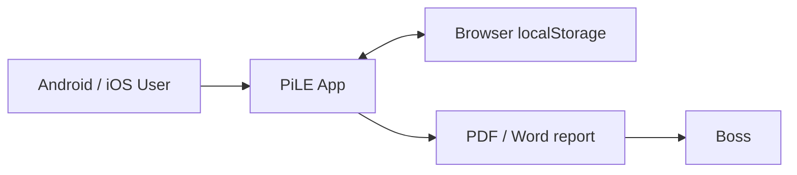

# PiLE App Design

## Goal

PiLE is a local-first piling record app for Android and iOS users. Site teams can enter piling usage by project, block, piling point, date, and pile length. Each user keeps their own records on their browser/device and sends reports individually.

## First Version

The first version is a mobile-first PWA:

- Runs in mobile browsers on Android and iOS.
- Can be installed to the home screen when served over HTTPS.
- Stores data locally in the user's browser.
- Does not use cloud storage.
- Can later be wrapped into Android/iOS apps with Capacitor without changing the core screen.

## Core Screen

The first screen is the working record screen:

- Project Name
- Block Name
- Supervisor
- Piling Point Numbers
- Calendar date input, displayed as `day.month.year`
- 3m, 6m, 9m, 12m counts
- Per-record total pieces, total meters, and no. of welding
- Date-grouped record list
- Project/search filters
- CSV export
- Daily report export by date and site, with PDF and Word output

## Local Architecture



When a user saves a record, it is stored in that browser only. The same user can edit and delete their local records, then export a daily report as PDF or Word.

## Record Identity

A record is identified by:

```text
Project Name + Block Name + Piling Point Numbers + Date
```

Saving the same point on the same date updates the existing record. This avoids duplicate records when multiple users are working on the same block.

## Recommended Production Steps

1. Host the static files over HTTPS.
2. Ask each user to install the PWA or open the hosted link.
3. Users keep their own local records and send reports individually.
4. Wrap with Capacitor for Play Store and App Store builds if needed.

## Future Enhancements

- Login with phone number or company email.
- Project-level user permissions.
- Import/export to Excel.
- Supervisor approval status.
- Photo attachment for each piling point.
- GPS/location stamp.
- Audit history per record.
- Report template customization.
