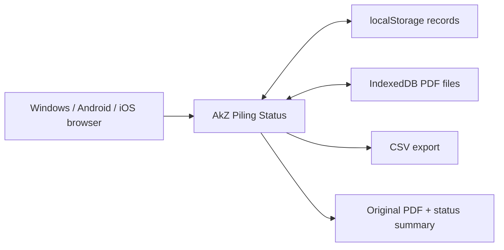

# AkZ Piling Status Design

## Goal

AkZ Piling Status is a local-first PDF piling tracker. Site teams upload setting-out PDFs, review extracted drawing information, maintain a pile register by grid, and record piling date plus penetration depth until the drawing is complete.

## Product Shape

The first screen is the working app, not a landing page:

- PDF upload and active drawing selector
- Editable project title and drawing title
- Editable grid letters and grid numbers
- Pile register with per-pile grid dropdown
- Daily input form for X-axis grid, Y-axis grid, pending pile number, piling date, penetration depth, and remarks
- Latest status table and selected-pile history
- CSV export and original-PDF based status PDF output
- Fixed bottom-right `Ver1.0.4`

## Local Architecture

Data belongs to the browser/device. Updating the hosted app revision does not clear the user's local project records.

## PDF Extraction

The app reads both the PDF text layer and a rendered drawing image in the browser:

- Project title and drawing title are extracted from title block labels when readable.
- X-axis grid lines are detected from the drawing geometry and labeled with grid letters.
- Y-axis grid lines are detected from the left-side grid extension and labeled with grid numbers.
- Red pile-number labels are OCR-scanned from a red-only image mask.
- Dense numbered sequences are completed after OCR outliers are removed, then reviewed in the editable table.

## Versioning

Use semantic app display versions:

- `Ver1.0.0` for the first AkZ release
- `Ver1.0.1` for red pile-number and X/Y grid visual extraction
- `Ver1.0.2` for blue in-drawing PDF date/depth markups
- `Ver1.0.3` for split X/Y Daily input and pending-only pile choices
- `Ver1.0.4` for OCR sequence outlier cleanup and arrowed PDF markups
- `Ver1.1.0` for larger feature changes

The version should be updated in the UI, service worker cache, manifest start URL, and documentation together.
