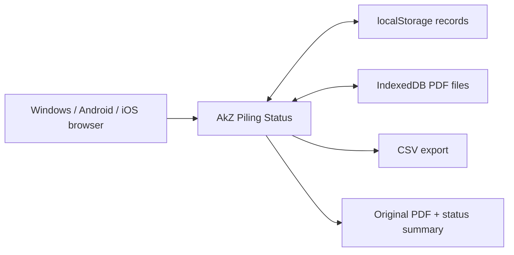

# AkZ Piling Status Design

## Goal

AkZ Piling Status is a local-first PDF piling tracker. Site teams upload setting-out PDFs, review extracted drawing information, maintain a pile register by grid, and record piling date plus penetration depth until the drawing is complete.

## Product Shape

The first screen is the working app, not a landing page:

- PDF upload and active drawing selector
- Editable project title and drawing title
- Editable grid letters and grid numbers
- Pile register with per-pile grid dropdown
- Daily input form for grid, pile number, piling date, penetration depth, and remarks
- Latest status table and selected-pile history
- CSV export and original-PDF based status PDF output
- Fixed bottom-right `Ver1.0.0`

## Local Architecture

Data belongs to the browser/device. Updating the hosted app revision does not clear the user's local project records.

## PDF Extraction

The app reads the PDF text layer in the browser using PDF.js:

- Project title and drawing title are extracted from title block labels when readable.
- Grid letters and grid numbers are detected from aligned text labels when readable.
- Pile numbers are detected when the PDF contains normal text pile labels.
- CAD/vector pile numbers that are not exposed as PDF text are handled through the editable review table and range import.

## Versioning

Use semantic app display versions:

- `Ver1.0.0` for this first AkZ release
- `Ver1.0.1` for minor fixes
- `Ver1.1.0` for larger feature changes

The version should be updated in the UI, service worker cache, manifest start URL, and documentation together.
